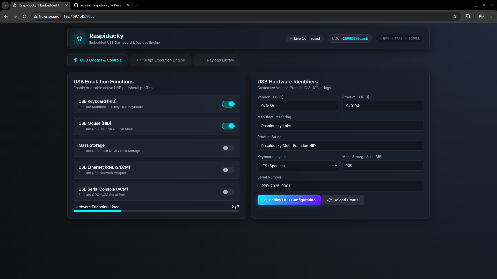
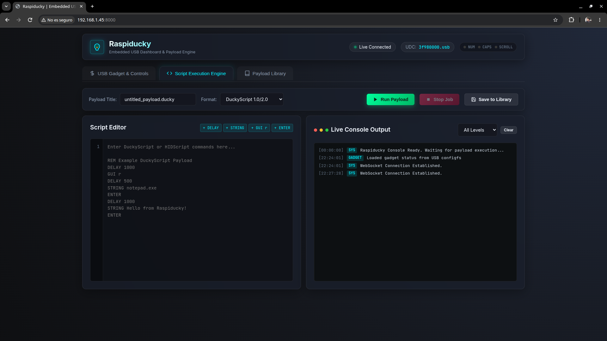
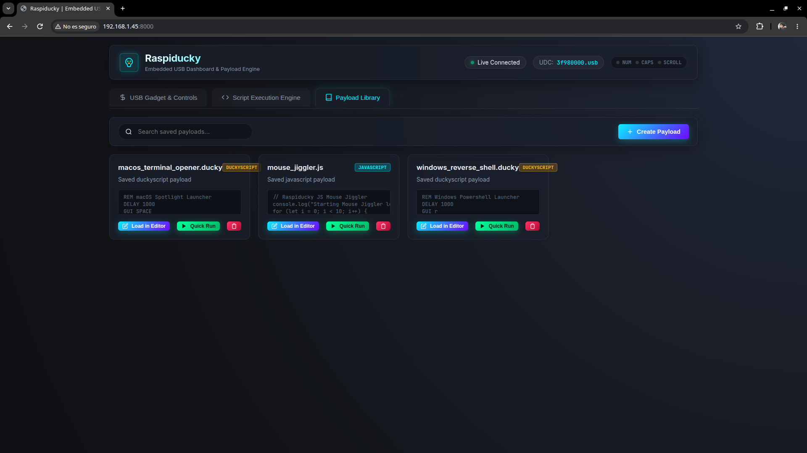

# 🦆⚡ Raspiducky

> A modern, high-performance, and lightweight USB Gadget & DuckyScript/HIDScript execution appliance for Raspberry Pi Zero W (and compatible SBCs).

Designed to run as a **single Go executable** on lightweight Linux distributions (like Raspberry Pi OS Lite), Raspiducky turns your Pi into a powerful, multi-purpose USB attack/automation tool.

---

## ✨ Why Raspiducky?

* **Single Executable Binary:** Built in modern Golang, incorporating an embedded REST API, WebSocket server, CLI commands, and a sleek single-page web dashboard using `go:embed`.
* **Plug & Play Linux USB ConfigFS:** Direct interaction with `/sys/kernel/config/usb_gadget` for runtime configuration *without* system reboots.
  * ⌨️ **HID Keyboard:** 8-byte reports with multi-language layout translation (**US**, **ES**, **DE**, **FR**).
  * 🖱️ **HID Mouse:** Relative movements, absolute positioning, and button clicks.
  * 💾 **USB Mass Storage (UMS):** Mount ISO or RAW disk image backing files in CD-ROM or writable Flash Drive modes.
  * 🌐 **USB Network:** CDC ECM (Linux/Mac) and RNDIS (Windows) with custom MAC addresses and Windows OS descriptors.
  * 🔌 **USB Serial:** CDC ACM serial device interface.
* **Dual Scripting Engines:**
  * **JavaScript Engine (Goja):** Pure Go ECMAScript 5.1+ runtime with native USB HID bindings (`type()`, `press()`, `delay()`, `layout()`, `typingSpeed()`, `waitLED()`, `mouseMove()`, `mouseMoveTo()`, `mouseClick()`).
  * **DuckyScript Parser:** Transparently parses and executes standard Hak5 Rubber Ducky `.txt` scripts.
* **Host Keyboard LED State Listener:** Reads output reports from `/dev/hidg0` (NUMLOCK, CAPSLOCK, SCROLLLOCK), enabling synchronization and payload triggering based on target host interactions.

---

## 🖼️ Web Dashboard Showcase

A sleek, dark-mode single-page dashboard with real-time WebSocket log streaming, a payload editor, job manager, and gadget controls.

| Main Dashboard & Gadget Control | Script Editor & Live Execution Console |
| :---: | :---: |
|  |  |

<br>
<p align="center">
  <b>Payload Library & Job Manager</b><br><br>
  
</p>

---

## 🚀 Getting Started

### ⚡ Quick Installation & Auto-Update (Recommended)

Run this single command on your Raspberry Pi (or Linux target) to automatically detect the architecture, download the latest release binary, configure USB Gadget kernel overlays, and set up the systemd service:

```bash
curl -fsSL https://raw.githubusercontent.com/arrase/Raspiducky/master/install.sh | sudo sh
```
*Running this command again in the future will automatically update Raspiducky to the latest GitHub release.*

---

## 💻 Hardware Compatibility & USB OTG Support

> ⚠️ **Important Hardware Requirement**:
> USB Gadget mode requires a Single Board Computer (SBC) where the USB OTG controller (DWC2, DWC3, or MUSB) is connected directly to a Micro-USB or USB-C OTG port **without an onboard USB Hub chip**.
>
> * ✅ **Supported RPi Ports**: Raspberry Pi Zero / Zero W / Zero 2 W (Micro-USB USB port), Raspberry Pi 3A+ / A+ (Type-A OTG port), Raspberry Pi 4B / 5 (USB-C power/data port).
> * ❌ **Unsupported RPi Ports**: Standard Type-A ports on Raspberry Pi 1B, 2B, 3B, and 3B+ pass through an onboard LAN9512/LAN9514/LAN7515 USB hub chip which prevents USB Device/Gadget mode.

<details>
<summary><b>🚦 Hardware Endpoint Limits (Click to expand)</b></summary>
<br>

Depending on your SBC's USB controller, there is a physical hardware limit on the maximum number of **USB IN Endpoints** that can be active simultaneously:

* **Raspberry Pi Zero / 1 / 2 / 3 (DWC2 Controller)**: Limited to **7 IN Endpoints**.
* **Raspberry Pi 4 / 5 (DWC3 Controller)**: Limited to **15 IN Endpoints**.
* **Other SBCs (e.g., Orange Pi, NanoPi)**: Varies depending on the SoC's USB controller.

**Endpoint Consumption per Function:**
* ⌨️ **USB Keyboard (HID)**: 1 Endpoint
* 🖱️ **USB Mouse (HID)**: 1 Endpoint
* 💾 **Mass Storage**: 1 Endpoint
* 🔌 **USB Serial Console (ACM)**: 2 Endpoints
* 🌐 **USB Ethernet (RNDIS/ECM)**: 4 Endpoints (2 for RNDIS, 2 for ECM)

*The Raspiducky Web Dashboard automatically reads your specific board's limits directly from the kernel DebugFS and prevents you from deploying a combination of functions that exceeds your hardware's capabilities.*
</details>

<details>
<summary><b>📋 Supported Boards & Binary Asset Matrix (Click to expand)</b></summary>
<br>

| Asset Name | Architecture | Target SBC Boards | USB OTG Port |
|---|---|---|---|
| **`raspiducky-linux-armv6`** | ARMv6 (32-bit) | • **RPi Zero / Zero W**<br>• **RPi Model A / A+** | Micro-USB |
| **`raspiducky-linux-armv7`** | ARMv7 (32-bit) | • **RPi 3A+** *(32-bit OS)*<br>• **RPi CM 3**<br>• **Banana Pi M2 Zero/M1**<br>• **Orange Pi Zero/One/PC**<br>• **NanoPi NEO** | Micro-USB |
| **`raspiducky-linux-arm64`** | ARM64 (64-bit) | • **RPi Zero 2 W** *(64-bit OS)*<br>• **RPi 4B / 5** *(USB-C)*<br>• **RPi 3A+** *(64-bit OS)*<br>• **RPi CM4 / CM5**<br>• **Orange Pi Zero 2/3/5**<br>• **NanoPi R2S/R4S/NEO3**<br>• **Radxa Rock Pi**<br>• **Pine64 Quartz64** | USB-C / Micro-USB |
| **`raspiducky-linux-amd64`** | x86_64 (64-bit) | • **Standard PC / Intel NUC** *(Linux with USB OTG/UDC hardware or vUSB testing)* | USB-C OTG |
</details>

---

## 🎮 Usage

### 1. Starting the Daemon & Web Dashboard
Run `raspiducky` in daemon mode with root privileges (required to interact with `/sys/kernel/config/usb_gadget` and `/dev/hidg*`):

```bash
sudo ./raspiducky daemon -port :8000 -layout US
```
> *Note: The `-layout` flag sets the default keyboard layout (e.g., `US`, `ES`, `DE`, `FR`).*

Open your browser and navigate to `http://<raspberry-pi-ip>:8000` to access the live dashboard.

### 2. Executing Scripts via CLI
You can execute a DuckyScript (`.txt`) or JavaScript (`.js`) file directly from the command line:

```bash
sudo ./raspiducky run payloads/hello_world.txt -layout ES
```

---

## 📜 Scripting Examples

Raspiducky supports both standard DuckyScript and an advanced JavaScript API.

### 🦆 DuckyScript Example (`hello.txt`)
```duckyscript
REM Standard Rubber Ducky Payload
DELAY 1000
GUI r
DELAY 500
STRING notepad.exe
ENTER
DELAY 1000
STRING Hello World from Raspiducky!
ENTER
```

### ⚡ JavaScript HIDScript Example (`hello.js`)
```javascript
// Set keyboard layout to Spanish and speed
layout("es");
typingSpeed(20, 50);

// Open Run dialog on Windows
press("GUI R");
delay(500);
type("notepad.exe\n");
delay(1000);

// Type text
type("Hello from Raspiducky JS Engine!\n");

// Wait for target user to hit NumLock key
waitLED("NUM", 10000);
type("NumLock was toggled on host!\n");
```

---

## 🛠️ Advanced: Building from Source

<details>
<summary><b>View Build Instructions</b></summary>
<br>

#### Native Build (On Target Device)
```bash
git clone https://github.com/arrase/Raspiducky.git
cd Raspiducky
go build -o build/raspiducky ./cmd/raspiducky
```

#### Cross-Compiling for Specific Targets

* **Raspberry Pi Zero / Zero W (ARMv6)**:
  ```bash
  GOOS=linux GOARCH=arm GOARM=6 go build -ldflags="-s -w" -o build/raspiducky-linux-armv6 ./cmd/raspiducky
  ```
* **Raspberry Pi 3A+ / Banana Pi M2 Zero / Orange Pi (ARMv7 32-bit)**:
  ```bash
  GOOS=linux GOARCH=arm GOARM=7 go build -ldflags="-s -w" -o build/raspiducky-linux-armv7 ./cmd/raspiducky
  ```
* **Raspberry Pi Zero 2 W / Pi 4 / Pi 5 / Orange Pi 5 / Radxa (ARM64 64-bit)**:
  ```bash
  GOOS=linux GOARCH=arm64 go build -ldflags="-s -w" -o build/raspiducky-linux-arm64 ./cmd/raspiducky
  ```
</details>

---

## 🏗️ Architecture

<details>
<summary><b>View Architecture Diagram</b></summary>
<br>

```text
                                  +---------------------------------------+
                                  |         Web Browser / REST / WS       |
                                  +-------------------+-------------------+
                                                      |
                                                      v
+---------------------------------------------------------------------------------------------------+
| Raspiducky (Single Executable)                                                                    |
|                                                                                                   |
|  +-------------------+   +--------------------+   +-----------------------+   +----------------+  |
|  | Embedded Web UI   |   |   REST & WS API    |   |  Goja JS Engine &     |   | Storage        |  |
|  | (go:embed)        |   |   (pkg/api)        |   |  DuckyScript Parser   |   | (pkg/storage)  |  |
|  +-------------------+   +---------+----------+   +-----------+-----------+   +----------------+  |
|                                    |                      |                                       |
|                                    v                      v                                       |
|                         +-----------------------------------+                                     |
|                         |    HID & ConfigFS Controllers     |                                     |
|                         |    (pkg/gadget, pkg/hid)          |                                     |
|                         +-----------------+-----------------+                                     |
+-------------------------------------------|-------------------------------------------------------+
                                            |
                                            v
                      +-------------------------------------------+
                      | Linux Kernel ConfigFS & /dev/hidgX        |
                      +-------------------------------------------+
```
</details>

---

## 📡 REST API Reference

| Endpoint | Method | Description |
| :--- | :--- | :--- |
| `/api/gadget` | `GET` | Retrieve active USB gadget configuration & state |
| `/api/gadget` | `POST` | Update and deploy new USB gadget parameters |
| `/api/scripts` | `GET` | List all saved script templates |
| `/api/scripts` | `POST` | Save or update a script template |
| `/api/scripts/{name}` | `DELETE` | Delete a script template |
| `/api/run` | `POST` | Trigger script execution (JS or DuckyScript) |
| `/api/stop` | `POST` | Stop active script execution |
| `/api/ws` | `GET` | Real-time WebSocket connection for logs & status events |

---

## 📄 License
This project is released under the **MIT License**.
