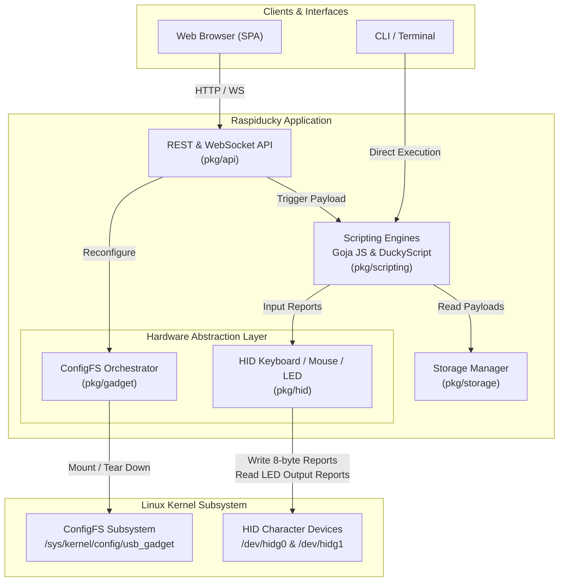

# Architecture & Core Engine

Raspiducky is architected as a lightweight, high-performance, single-binary appliance designed for Linux Single Board Computers (SBCs) equipped with USB OTG hardware controllers. It abstracts complex kernel USB composite gadget drivers into a high-level REST/WebSocket API, Web Dashboard, and scripting runtime.

---

## 🏗️ High-Level System Architecture

The application is written in Go 1.22+ to ensure zero external shared library dependencies, low memory footprint (~15-25 MB RSS), and instant startup times.

The single binary embeds the entire web frontend using Go's native `go:embed` filesystem (`embed.FS`). When started, Raspiducky launches an HTTP server providing both the single-page application (SPA) and an API server communicating directly with internal package modules.



---

## 🐧 Linux Kernel ConfigFS & USB Gadgets

Raspiducky leverages the Linux kernel's **ConfigFS** (`usb_gadget`) interface located at `/sys/kernel/config/usb_gadget/`. Unlike traditional legacy gadget modules (like `g_ether` or `g_hid`), ConfigFS enables dynamic construction of composite USB devices at runtime without needing kernel module reloads or rebooting.

### 1. Gadget Lifecycle & Bindings
1. **Creation**: A gadget directory (e.g. `/sys/kernel/config/usb_gadget/raspiducky`) is initialized with Vendor ID (`idVendor`), Product ID (`idProduct`), Serial Number, and Manufacturer strings.
2. **Function Definition**: Functions are instantiated inside `functions/`:
   - `hid.usb0`: HID Keyboard device
   - `hid.usb1`: HID Mouse device
   - `mass_storage.usb0`: USB Mass Storage device
   - `ecm.usb0` / `rndis.usb0`: USB Network interfaces
   - `acm.usb0`: Serial terminal interface
3. **Configuration & Binding**: Descriptors are added to `configs/c.1/` and symlinked to function directories.
4. **UDC Activation**: Writing the active USB Device Controller name (e.g., `20980000.usb` or `dwc3.0.auto`) into `/sys/kernel/config/usb_gadget/raspiducky/UDC` binds the composite gadget to physical hardware.

### 2. Character Device I/O (`/dev/hidg*`)
Once bound, the kernel exposes raw character devices:
- `/dev/hidg0`: Keyboard endpoint (IN for keystrokes, OUT for LED reports).
- `/dev/hidg1`: Mouse endpoint (IN for mouse movement and button events).

Raspiducky opens these device descriptors with POSIX `O_WRONLY|O_SYNC` for low-latency report delivery and `O_RDONLY` for LED status capture.

---

## 📦 Package Architecture

The codebase is organized into domain-driven Go packages inside `pkg/`:

```text
pkg/
├── api/          # HTTP REST API handlers, WebSocket hub, and embedded Web UI assets
├── gadget/       # ConfigFS orchestrator, UDC controller detection, and hardware limit checks
├── hid/          # Raw 8-byte report encoders, keymaps (US, ES, DE, FR), mouse drivers, and LED watcher
├── scripting/    # DuckyScript line-by-line compiler & Goja ECMAScript 5.1+ engine bindings
└── storage/      # File-based persistence for script payloads and gadget profiles
```

### `pkg/gadget`
Acts as the kernel ConfigFS driver. It handles gadget creation, function configuration (Keyboard, Mouse, UMS, Network, Serial), and UDC binding/unbinding. It also queries DebugFS to enforce endpoint limits based on board hardware.

### `pkg/hid`
Implements the USB Human Interface Device protocols:
- `keyboard.go`: Translates Unicode characters and key combo strings into USB HID keycodes and modifier bitmasks. Supports inter-keystroke delay and jitter.
- `keymap.go`: Contains key translation tables for **US**, **ES**, **DE**, and **FR** keyboard layouts.
- `mouse.go`: Generates 4-byte relative and 6-byte absolute HID mouse reports.
- `led.go`: Asynchronously reads host output reports from `/dev/hidg0` to detect `NUMLOCK`, `CAPSLOCK`, and `SCROLLLOCK` state changes.

### `pkg/scripting`
Drives payload execution:
- `duckyscript.go`: Transpiles Hak5 Rubber Ducky commands (`STRING`, `DELAY`, `GUI r`, `REM`) into equivalent JavaScript AST instructions.
- `engine.go`: Embeds the [Goja](https://github.com/dop251/goja) ECMAScript engine, injecting native Go bindings for keyboard, mouse, delay, and LED control (`type()`, `press()`, `delay()`, `waitLED()`, etc.).
- `runner.go`: Manages non-blocking job execution, execution states (running, stopped, failed), and context cancellation.

### `pkg/api`
Serves web traffic and API integration:
- `server.go`: Initializes HTTP routes and middleware.
- `embed.go`: Holds `go:embed web/*` compiling static Web UI assets directly into the application binary.
- `websocket.go`: Pushes real-time execution logs, LED state shifts, and gadget deployment events to active browser sessions.
