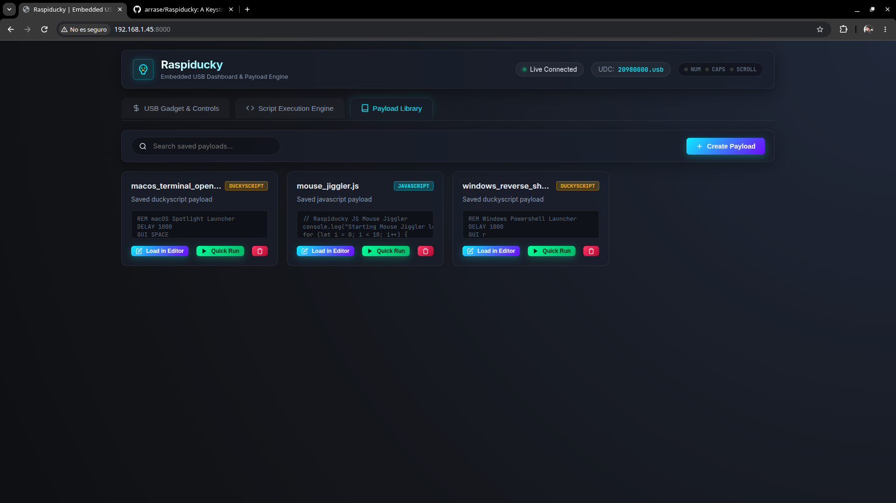

# Raspiducky

High-Performance USB Gadget & DuckyScript Appliance

---

## Key Features

- <i class="fa-solid fa-cube feature-icon"></i> **Single Binary Architecture**: Built in modern Golang with zero runtime external dependencies and an embedded Web UI via `go:embed`.
- <i class="fa-solid fa-microchip feature-icon"></i> **Linux Kernel ConfigFS**: Direct interaction with `/sys/kernel/config/usb_gadget` and `/dev/hidg*` char devices for dynamic gadget configuration without reboots.
- <i class="fa-solid fa-code feature-icon"></i> **Dual Scripting Engine**: Native execution of standard Hak5 Rubber Ducky scripts (`.txt`) and advanced ECMAScript 5.1+ JavaScript payloads (`.js`).
- <i class="fa-solid fa-lightbulb feature-icon"></i> **Host LED Listener**: Monitors output reports from `/dev/hidg0` (`NUMLOCK`, `CAPSLOCK`, `SCROLLLOCK`) enabling target-host synchronization and trigger-based execution.
- <i class="fa-solid fa-gauge-high feature-icon"></i> **Web Dashboard & REST API**: Modern dark-mode SPA with real-time WebSocket log streaming, script editor, job manager, and live gadget controls.
- <i class="fa-solid fa-layer-group feature-icon"></i> **Multi-Board Support**: Cross-compiled binaries for ARMv6, ARMv7, ARM64, and AMD64 targeting Raspberry Pi Zero, Pi 3, Pi 4, Pi 5, Orange Pi, and NanoPi.

---

## Screenshot Gallery

| Main Dashboard & Gadget Control | Script Editor & Live Execution Console | Payload Library & Job Manager |
| :---: | :---: | :---: |
|  |  |  |

---

## Documentation Topics

  <a href="architecture.md" class="feature-card">
    <i class="fa-solid fa-sitemap feature-icon"></i>
    <h3>Architecture & Core Engine</h3>
    
High-level system architecture, single-binary Go design, ConfigFS kernel interaction, and package breakdown.

  </a>

  <a href="usb-gadgets.md" class="feature-card">
    <i class="fa-solid fa-usb feature-icon"></i>
    <h3>USB Gadget Functions</h3>
    
Technical breakdown of Keyboard, Mouse, Mass Storage, CDC-ECM/RNDIS Network, and ACM Serial interfaces.

  </a>

  <a href="scripting.md" class="feature-card">
    <i class="fa-solid fa-terminal feature-icon"></i>
    <h3>DuckyScript & JS Engines</h3>
    
Dual scripting runtime guide, Hak5 Rubber Ducky syntax, Goja JavaScript API reference, and host LED listeners.

  </a>

  <a href="web-dashboard-api.md" class="feature-card">
    <i class="fa-solid fa-globe feature-icon"></i>
    <h3>Web Dashboard & REST API</h3>
    
Single Page Application features, REST endpoints reference, and WebSocket real-time event streaming.

  </a>

  <a href="hardware-compatibility.md" class="feature-card">
    <i class="fa-solid fa-microchip feature-icon"></i>
    <h3>Hardware & SBC Matrix</h3>
    
USB OTG controller types, DWC2 vs DWC3 IN endpoint hardware limits, supported boards, and binary assets.

  </a>

  <a href="cli-automation.md" class="feature-card">
    <i class="fa-solid fa-gears feature-icon"></i>
    <h3>CLI & Headless Automation</h3>
    
Daemon mode flags, headless payload execution, systemd integration, and boot-time crontab automation.

  </a>

  <a href="installation.md" class="feature-card">
    <i class="fa-solid fa-download feature-icon"></i>
    <h3>Installation & Building</h3>
    
One-line automated installation script, cross-compilation instructions, and building from source.

  </a>

